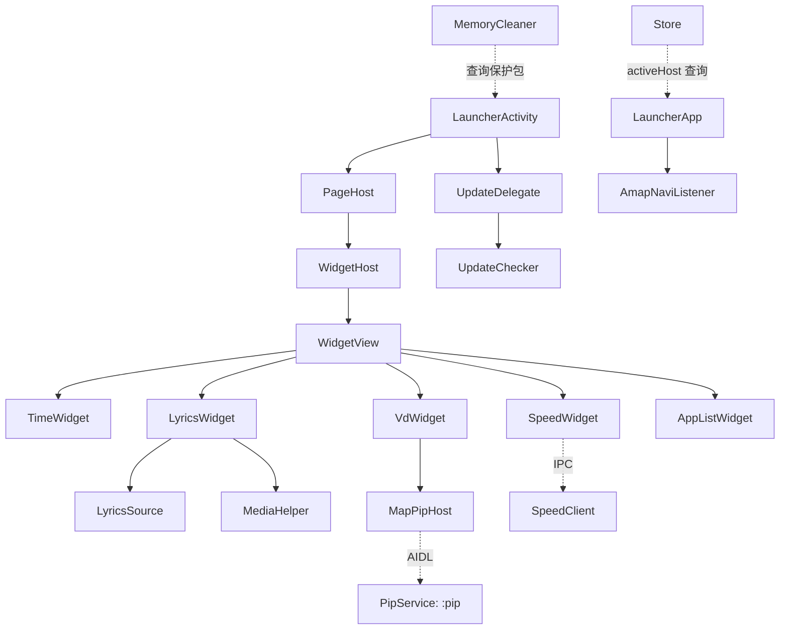

# CarLauncher 项目整体架构

> Code Wiki · 01 · 项目概览与整体架构
> 适用版本：Launcher37Kotlin（包名 `com.android.launcher37`，应用名 **CarLauncher**）

## 1. 项目定位

一个面向 **Android 车载中控屏（1280×720）** 定制的 **HOME 启动器（Launcher）**。突破普通
启动器局限，作为 **system app** 运行（`sharedUserId="android.uid.system"`，platform key
签名），以获得 `VirtualDisplay` 悬浮窗、静默安装、后台进程清理等系统级特权。

核心能力：

- **PIP 地图悬浮窗**：把高德地图/导航应用显示在独立 `VirtualDisplay` 的悬浮卡片中（多槽位）。
- **自定义 Widget 桌面**：自由画布，绝对定位的可编辑组件（时间 / 音乐歌词 / 车速导航 / VD 应用窗 / 应用列表）。
- **音乐卡**：`MediaSessionManager` 驱动的播放控制、进度、歌词。
- **全部应用抽屉**：Activity 弹窗 + 系统悬浮窗两种形态，含内存清理、分屏。
- **后台进程清理**：`forceStopPackageAsUser` 激进清理，保护正在播放的音乐与 VD 承载的地图。
- **应用内在线更新**：GitHub Releases 拉取 + `PackageInstaller` session 静默安装。

## 2. 运行形态与进程模型

| 进程 | 承载组件 | 职责 |
|------|----------|------|
| 主进程（默认） | `LauncherActivity`、`SettingsActivity`、`DrawerService`、全部 Widget、`MediaHelper`、导航客户端 | 桌面渲染、用户交互、音乐/导航数据接收 |
| `:pip` 独立进程 | `PipService` | 独立持有 `VirtualDisplay`；launcher 进程被杀时导航任务不中断（升级时系统会 `forceStopPackage` 杀掉所有进程） |

多进程的核心价值：`MapPipHost`（launcher 进程）通过 AIDL 把 `SurfaceView` 的 `Surface`
交给 `:pip` 进程的 `PipService`，VD 及上面的导航任务在 launcher 崩溃后依然存活（升级时系统会 `forceStopPackage` 杀掉所有进程）。

## 3. 分层架构

```
┌────────────────────────────────────────────────────────────┐
│  Presentation / UI                                          │
│   LauncherActivity · SettingsActivity · AppDrawer ·         │
│   HomeWidget(Time/Lyrics/Speed/VD/AppList) · DrawerService  │
├────────────────────────────────────────────────────────────┤
│  Application / 全局状态                                     │
│   LauncherApp（activeHost 全局入口）· AppDrawer(object)     │
├────────────────────────────────────────────────────────────┤
│  Domain / 业务逻辑                                          │
│   Widget 框架（WidgetHost/PageHost/Designer/WidgetView）    │
│   navi（AmapNaviListener/NaviTextClient/SpeedClient/MapPip）│
│   music（MediaHelper/MusicLauncher）· data（Store/Update）·│
│   pip（PipService）                                        │
├────────────────────────────────────────────────────────────┤
│  Infrastructure / 平台设施                                  │
│   util（Prefs/FormatUtils/Icon*/Dbg/SysProps/Executor）·    │
│   AIDL（IPipService / syu.ipc）                            │
└────────────────────────────────────────────────────────────┘
```

## 4. 模块关系总览



## 5. 关键设计约定

- **跨模块查询**：无 Activity 上下文的调用方通过 `LauncherApp.activeHost`（全局 `PageHost`
  引用，Activity `onCreate` 赋值 / `onDestroy` 清空）查询 VD/播放保护集合。
- **线程模型**：网络/IO 统一走 `SharedExecutor.io()`（禁止自建 Executor）；UI 回调经
  `MainThread.handler` 回主线程。见 [05-dependencies](/workspace/docs/code-wiki/05-dependencies.md)。
- **AIDL 稳定性**：所有 AIDL 方法顺序即 transaction 号，只允许在末尾追加，禁止改动既有方法。
- **导航数据非侵入**：`AmapNaviListener` 与 `NaviTextClient` 各自独立 `registerReceiver`
  监听同一 `AUTONAVI_STANDARD_BROADCAST_SEND`，Android 框架向所有 receiver 派发，可共存。
- **导航不中断**：VD + 导航任务由独立进程 `PipService` 持有，规避 launcher 自身崩溃/被杀（升级时系统会 `forceStopPackage` 杀掉所有进程）。

## 6. 入口与生命周期

| 组件 | 触发方式 | 生命周期关键点 |
|------|----------|----------------|
| `LauncherApp.onCreate` | App 启动 | 启动 `AmapNaviListener` |
| `LauncherActivity.onCreate` | HOME | 建 `PageHost`、注入 `LauncherApp.activeHost`、建 `UpdateDelegate`、装 Widget/VD |
| `LauncherActivity.onDestroy` | 退出 | 清空 `activeHost` |
| `PipService` | 显式 bind | 独立进程常驻，持有 VD 与导航任务 |
| `DrawerService` | 抽屉/悬浮 | 独立悬浮窗服务（SYSTEM_ALERT_WINDOW） |

## 7. 文档导航

- [02-modules：主要模块职责](/workspace/docs/code-wiki/02-modules.md)
- [03-package-structure：包结构与文件清单](/workspace/docs/code-wiki/03-package-structure.md)
- [04-key-classes：关键类与函数说明](/workspace/docs/code-wiki/04-key-classes.md)
- [05-dependencies：依赖关系](/workspace/docs/code-wiki/05-dependencies.md)
- [06-build-run：构建与运行](/workspace/docs/code-wiki/06-build-run.md)