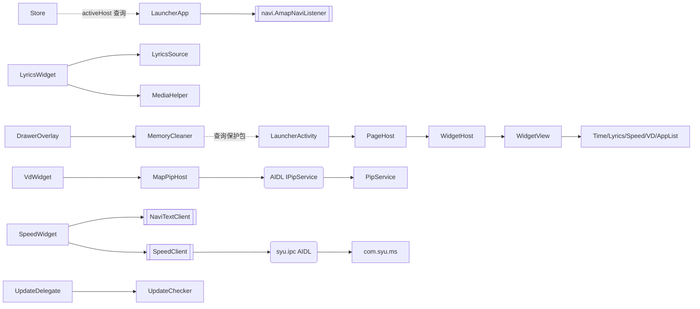

# 依赖关系

> Code Wiki · 05 · 依赖关系

## 1. Gradle / 第三方依赖

官方 Gradle 依赖根外仅一个运行时三方库，其余均为 Android 框架 / Kotlin 标准库：

| 依赖 | 版本 | 用途 |
|------|------|------|
| `androidx.recyclerview:recyclerview` | 1.3.2 | 设置页排序/隐藏列表 + ItemTouchHelper 长按拖拽（**唯一第三方运行时依赖**） |

Gradle 插件（`/workspace/build.gradle.kts`）：

| 插件 | 版本 |
|------|------|
| `com.android.application` | 8.13.2 |
| `org.jetbrains.kotlin.android` | 2.0.21 |

## 2. 模块依赖图（代码层）

## 3. 跨进程依赖

| 通信 | 依赖 | 方向 |
|------|------|------|
| launcher ↔ `:pip` | `IPipService.aidl`（多槽位 VD） | 双向 |
| launcher ↔ 车机服务 | `com.syu.ipc` AIDL（`IRemoteToolkit` 等） | launcher → `com.syu.ms` |
| 分屏 | `com.syu.splitscreenbutton` 广播 + 反射 `IActivityTaskManager.resizeDockedStack` | launcher → 系统 |
| 系统强杀 | 反射 `ActivityManager.forceStopPackageAsUser` | launcher → 系统 |

## 4. 外部数据源（网络）

| 数据源 | 端点 | 用途 |
|--------|------|------|
| GitHub Releases | `api.github.com/repos/txq1996/CarLauncher/releases/latest` | 应用内更新 |
| vkeys.cn | `api.vkeys.cn/v2/music/tencent/search/song` + `/lyric` | 歌词（QQ 音乐） |
| lrclib.net | `lrclib.net/api/get` + `/api/search` | 歌词兜底 |
| 专辑封面 | `SongInfo.cover` URL | 封面下载 |

## 5. 本地存储

| 位置 | 内容 |
|------|------|
| `SharedPreferences`（`Prefs.FILE`） | 抽屉排序/隐藏、更新节流时间、分屏配置、字号等设置 |
| `/sdcard/CarLauncher/music/<歌手>/<歌名>/` | 歌词 + 歌曲信息 + 封面 |
| `filesDir/lyrics/` | lrclib 兜底歌词缓存 |
| `cacheDir/update.apk` | 更新下载临时文件 |

## 6. 版本 / 构建依赖约束

- **Java 17**：`compileOptions` + `kotlinOptions.jvmTarget="17"`。
- **SDK**：`compileSdk=34`，`minSdk=28`（Android 9），`targetSdk=29`。
- **AIDL 契约稳定性**：`IPipService` / `com.syu.ipc` 方法顺序 = transaction 号，**只允许末尾追加**。
- **system 特权依赖链**：
  `sharedUserId=android.uid.system` + platform key 签名 → 持有 INTERNAL_SYSTEM_WINDOW /
  REAL_GET_TASKS / 静默安装 / forceStop 等特权。详见 [AndroidManifest.xml](/workspace/app/src/main/AndroidManifest.xml)。
- **签名**：`keys/keystore.jks`，alias/password `android/android`。
- **privapp 白名单**：`privapp-permissions-com.android.launcher37.xml`，需并入车机系统镜像 privapp 权限白名单。

## 7. 线程依赖约束（AGENTS 约定）

- 网络/IO → `SharedExecutor.io()`（禁止 `newSingleThreadExecutor` 等自建执行器）。
- UI 回调 → `MainThread.handler` 切回主线程；`startActivity` 必须在主线程。
- `MediaHelper` 进度 ticker 仅播放中运行（暂停/无 session 零轮询）。